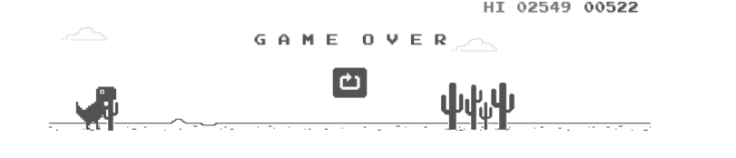

# DinoGame_Chrome
Automated Dino Game from Google Chrome using Python

The key presses 'space bar' , 'up' and 'down' keys are autoamted using Python libraries pyautogui and keyboard libraries.
The required libraries for this process are pyautogui,keyboard and time.
